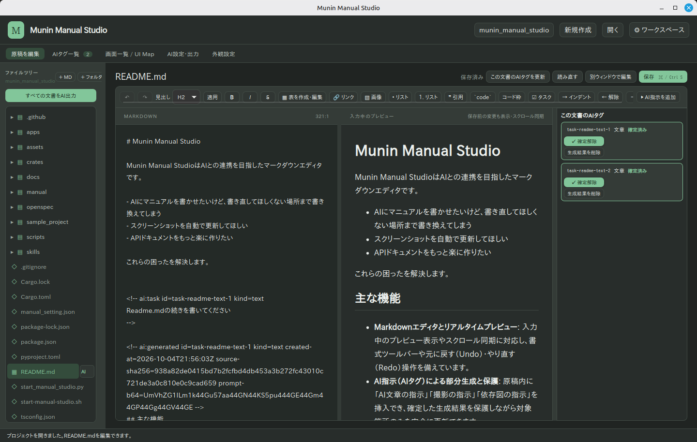
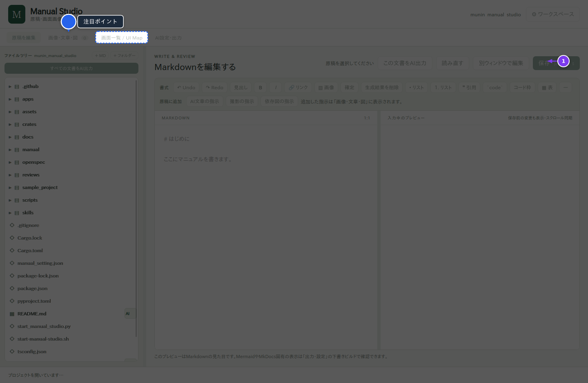

# Munin Manual Studio

Munin Manual StudioはAIとの連携を目指したマークダウンエディタです。

* AIにマニュアルを書かせたいけど、書き直してほしくない場所まで書き換えてしまう
* スクリーンショットを自動で更新してほしい
* APIドキュメントをもっと楽に作りたい

これらの困ったを解決します。

<br />

<br />



<!-- ai:task id=task-readme-screenshot-2 kind=screenshot prompt="起動アプリ: /home/ishii/PycharmProjects/pymodulemgr/target/release/manual-studio&#10;&#10;記録した操作:&#10;1. クリック: (273, 90)&#10;&#10;MarkIts アノテーション仕様:&#10;```json&#10;{&#10;  &quot;canvas&quot;: {&#10;    &quot;height&quot;: 940,&#10;    &quot;width&quot;: 1440&#10;  },&#10;  &quot;annotations&quot;: [&#10;    {&#10;      &quot;position&quot;: &quot;right&quot;,&#10;      &quot;step&quot;: 1,&#10;      &quot;style&quot;: &quot;step&quot;,&#10;      &quot;target&quot;: [&#10;        1242,&#10;        125,&#10;        100,&#10;        50&#10;      ],&#10;      &quot;type&quot;: &quot;step-arrow&quot;&#10;    },&#10;    {&#10;      &quot;position&quot;: &quot;top&quot;,&#10;      &quot;style&quot;: &quot;primary&quot;,&#10;      &quot;target&quot;: [&#10;        105,&#10;        77,&#10;        126,&#10;        29&#10;      ],&#10;      &quot;text&quot;: &quot;注目ポイント&quot;,&#10;      &quot;type&quot;: &quot;pin&quot;&#10;    },&#10;    {&#10;      &quot;style&quot;: &quot;primary&quot;,&#10;      &quot;target&quot;: [&#10;        234,&#10;        77,&#10;        128,&#10;        29&#10;      ],&#10;      &quot;type&quot;: &quot;spotlight&quot;&#10;    }&#10;  ]&#10;}&#10;```" created-at=2026-10-07T21:04:46Z source-sha256=6222b8572832fbeb46497a4e3bd8c6edbd6a439c78d6b5cbdd3fd5e3c487e334 -->

<!-- /ai:task -->

<!-- ai:task id=task-readme-text-3 kind=text prompt="ここに目次を書いてください" created-at=2026-10-07T21:04:29Z source-sha256=21f0494adbfe2147148a1b6973542858c67adcda07c1350eb3a3d64cbae52f38 -->
* [主な機能](#主な機能)
* [クイックスタート](#クイックスタート)
<!-- /ai:task -->。

## 主な機能

<!-- ai:task id=task-readme-text-1 kind=text prompt="主な機能を箇条書して" created-at=2026-10-07T21:04:29Z source-sha256=a33680233ab44a4097278be10c87ced00b9a627d4a5c655a67d5a4ec0ec2d7c2 -->
* **Markdown編集とリアルタイムプレビュー**: 左右分割でのプレビュー確認に対応し、Mermaidによる作図やリッチテキスト・書式ツールバーによる編集が可能です。<!-- ai:fact {"claim":"左右分割でのプレビュー表示に対応","file":"apps/manual-studio/index.html","contains":"\u003cdiv class=\"editor-split\"\u003e","ui":null,"symbol":null} --><!-- ai:fact {"claim":"書式ツールバーにMermaid図挿入ボタンがある","file":"apps/manual-studio/index.html","contains":"\u003cbutton type=\"button\" data-format=\"mermaid\" title=\"Mermaidの図を挿入\" aria-label=\"Mermaidの図を挿入\"\u003eMermaid\u003c/button\u003e","ui":null,"symbol":null} -->
* **AIタグによる部分的な自動生成**: 原稿内に文章・撮影・図のAI指示タグ（`ai:task`）を追加でき、書き直したくない箇所を保持しながら指定部分のみを更新できます。<!-- ai:fact {"claim":"AI指示を追加するメニューに文章の指示・撮影の指示・図の指示がある","file":"apps/manual-studio/index.html","contains":"\u003cbutton type=\"button\" data-insert=\"text\"\u003e文章の指示\u003c/button\u003e\u003cbutton type=\"button\" data-insert=\"screenshot\"\u003e撮影の指示\u003c/button\u003e\u003cbutton type=\"button\" data-insert=\"diagram\"\u003e図の指示\u003c/button\u003e","ui":null,"symbol":null} -->
* **スクリーンショットの自動撮影・更新**: 対象ウィンドウや余白を指定して撮影し、以後は同じ撮影元から再撮影して画像を更新できます。<!-- ai:fact {"claim":"対象ウィンドウと除外余白を指定して撮影し、以後は同じ撮影元で更新で再撮影できる","file":"apps/manual-studio/README.md","contains":"初回だけ対象ウィンドウと除外する余白を指定して撮影します。以後は「同じ撮影元で更新」で再撮影できます。","ui":null,"symbol":null} -->
* **UI Map（画面・操作一覧）の管理**: ソースコードから画面一覧を生成し、画面名・ボタン・入力欄の一覧をAI生成や撮影手順の参照情報として活用できます。<!-- ai:fact {"claim":"コードから画面一覧を作るボタンがある","file":"apps/manual-studio/index.html","contains":"\u003cbutton id=\"map-refresh\" class=\"primary\"\u003eコードから画面一覧を作る\u003c/button\u003e","ui":null,"symbol":null} -->
* **マニュアルのビルドと出力**: 下書きビルドや完成版ビルドにより、編集した原稿から静的HTMLマニュアルを生成して確認・出力できます。<!-- ai:fact {"claim":"下書きビルドと完成版ビルドのボタンがある","file":"apps/manual-studio/index.html","contains":"\u003cbutton id=\"build-draft\"\u003e下書きビルド\u003c/button\u003e\u003cbutton id=\"build-final\"\u003e完成版ビルド\u003c/button\u003e","ui":null,"symbol":null} -->
<!-- /ai:task -->

## クイックスタート

開発環境から起動する場合は以下のスクリプトを実行します。

```sh
python3 start_manual_studio.py
```

<!-- ai:fact {"claim":"開発環境からの起動コマンドは python3 start_manual_studio.py","file":"apps/manual-studio/README.md","contains":"python3 start_manual_studio.py"} -->

1. ワークスペースとして対象プロジェクトのフォルダーを開きます。
2. 左側のファイルツリーから原稿ファイルを選択するか、「＋ MD」ボタンで新しいページを作成します。
3. 原稿を編集し、「この文書のAIタグを更新」または「すべての文書をAI出力」からAI生成や撮影指示を実行します。<!-- ai:fact {"claim":"文書単位の更新ボタン名は「この文書のAIタグを更新」、全体実行ボタン名は「すべての文書をAI出力」","file":"apps/manual-studio/index.html","contains":"<button id=\"generate-page\" title=\"この文書のAI指示を実行し、文章・図・撮影結果を更新\">この文書のAIタグを更新</button>"} -->
4. 必要に応じて「下書きビルド」や「完成版ビルド」を実行してHTMLマニュアルを確認します。<!-- ai:fact {"claim":"下書きビルドと完成版ビルドのボタンがある","file":"apps/manual-studio/index.html","contains":"<button id=\"build-draft\" class=\"primary\">下書きビルド</button><button id=\"build-final\">完成版ビルド</button>"} -->
