# MarkIts 

<p align="center">
  
</p>

**MarkIts** は、スクリーンショットや画像の上に説明用アノテーションを生成するCLIツールです。

AI（LLM）と連携することに特化しており、トークン消費を抑えつつ、安定した品質のアノテーションを生成します。

> **「AIは『何を説明するか』を決め、MarkItsは『どう綺麗に見せるか』を決める」**

<p align="center">
  
</p>


<!-- ai:task id=task-readme-screenshot-1 kind=screenshot
撮影対象: ManualStudio
画面の状態・表示する操作要素: トップページを撮影
-->

<!-- ai:generated id=task-readme-screenshot-1 kind=screenshot created-at=2026-10-03T17:52:28Z source-sha256=f87196e780ffeb2fdd46a671b74b229c61ca8e66c45c060df5a2840983de60ea prompt-b64=5pKu5b2x5a++6LGhOiBNYW51YWxTdHVkaW8K55S76Z2i44Gu54q25oWL44O76KGo56S644GZ44KL5pON5L2c6KaB57SgOiDjg4jjg4Pjg5fjg5rjg7zjgrjjgpLmkq7lvbE= -->

<!-- /ai:generated -->


<!-- ai:task id=task-readme-text-1 kind=text
対象読者と説明する操作手順を指定してください。
-->

<!-- ai:generated id=task-readme-text-1 kind=text created-at=2026-10-03T17:49:38Z source-sha256=26894114f87b1efbc80f247d06bd9388626444b7bafff055a46f280be8c8a6fa prompt-b64=5a++6LGh6Kqt6ICF44Go6Kqs5piO44GZ44KL5pON5L2c5omL6aCG44KS5oyH5a6a44GX44Gm44GP44Gg44GV44GE44CC -->
**対象読者:** スクリーンショットを使った操作案内の作成者と、画面上の要素を指定して注釈を付ける AI エージェント。<!-- ai:fact {"claim":"UI 要素を指定して注釈を追加できる","file":"src/main.rs","contains":"Quick command to add a mark to a specific UI target without writing JSON"} -->

**説明する操作手順:**

1. `markits capture screen.png --detect-ui` で画面を撮影し、検出した UI 要素の情報を PNG に埋め込む。<!-- ai:fact {"claim":"capture の detect-ui は UI 要素を検出して出力 PNG に埋め込む","file":"src/main.rs","contains":"Detect desktop UI elements and embed UIMap metadata in the output PNG"} -->
2. `markits uimap screen.png` で UI 要素の一覧を確認する。<!-- ai:fact {"claim":"uimap は画像内の UIMap を表示する","file":"src/main.rs","contains":"Present/extract UI elements map (UIMap) from an image"} -->
3. `markits annotate screen.png --target "保存ボタン" --mark rect -o annotated.png` で対象を四角で囲み、注釈画像を保存する。<!-- ai:fact {"claim":"annotate は対象名とマーク種別を指定して PNG を出力できる","file":"src/main.rs","contains":"Output image path (.png)"} -->
<!-- /ai:generated -->

---

## 🎯 UI要素指定・スクショ撮影・AI自律連携 (UI Targeting & Screen Capture)

MarkIts は、**AI（LLM）が自律的に画面を認識し、UI要素を指定して的確な注釈を描画する**ための強力な機能を備えています。

ピクセル座標の計算や推測は不要です。AIは「**保存ボタンを四角で囲む**」「**検索欄に手順1の番号を付ける**」といった意図を、UI要素名やロール、番号で直接 CLI に指定できます。

---

### 1. MarkIts 単体でのスクリーンショット撮影 (`markits capture`)

外部ツールを介さず、MarkIts だけで画面全体のキャプチャや特定矩形の切り抜き、特定ウィンドウ/プロセスの直接撮影、マルチモニター選択が可能です。High-DPI ディスプレイ（スケールファクター）環境でも自動で座標整合が行われます。

```sh
# 基本キャプチャ（プライマリ画面）
markits capture screen.png

# 接続モニター一覧の確認（解像度・スケールファクター）
markits capture --list-screens
markits capture --list-screens --json

# サブモニター（第2画面）のキャプチャ
markits capture screen2.png --screen 1

# 開いているウィンドウ一覧の確認（Window ID, PID, App Name, 座標）
markits capture --list-windows
markits capture --list-windows --json

# ウィンドウ名（部分一致）またはWindow IDでウィンドウだけを直接撮影
markits capture win.png --window "カレンダー"
markits capture win.png --window 104857604

# プロセスID (PID) を指定して対象ウィンドウを直接撮影
markits capture proc.png --pid 10111

# UI要素検出つきキャプチャ（UI要素を検出し、PNGメタデータにUIMapを埋め込み）
markits capture screen.png --detect-ui

# 画面の特定領域のみをキャプチャ
markits capture screen.png --x 100 --y 100 --width 800 --height 600
```

---

### 2. ⚡ UIMap メタデータの使い回し（高速化の鍵）

画面上の UI ツリー探索（AT-SPI / Accessibility）は、アプリが多い環境では 1〜3 秒程度を要する重い処理です。

MarkIts は検出した UIMap を **PNG の標準メタデータ（`markits:ui_elements` テキストチャンク）に永続化**します。そのため、**過去の画像から UIMap をそのまま引き継ぐ（使い回す）** ことができます。

```sh
# 【UIMapの引き継ぎ】重いUI検出をスキップし、既存画像のメタデータをコピーして瞬時に撮影
markits capture screen2.png --uimap screen.png
```

- **メリット**: 新たなスクショ撮影はわずか数ミリ秒で完了し、かつ `screen.png` で検出した UI 要素情報（ボタンや入力欄の位置・名前）がそのまま `screen2.png` にも保持されます。
- `--uimap <PATH>` 引数は、すべてのコマンド（`capture`, `annotate`, `render`, `validate`）で **`.png` 画像パス** または **`.json` ファイル** の両方を透過的に受け付けます。

---

### 3. 🤖 AI による UI 要素指定と「保存ボタンを囲む」

AI は UIMap の要素名や役割、番号をそのまま `--target` に指定できます。

#### 「保存ボタンを四角で囲む」
```sh
# 四角枠（矩形）で囲む
markits annotate screen.png --target "保存ボタン" --mark rect -o annotated.png

# 角丸四角枠で囲む
markits annotate screen.png --target "保存ボタン" --mark rounded-rect -o annotated.png
```

#### スマートなターゲット名解決
MarkIts のパーサーは、AI が指定した名前を柔軟に解決します：
- **完全一致**: `--target "保存"`（要素名が `保存` のものにマッチ）
- **サフィックス自動除去**: `--target "保存ボタン"` → 自動で `"ボタン"` を除外して `"保存"` にマッチ（`"Submit button"` も同様）
- **ロールによる絞り込み**: `--target "button:保存"`（テキストラベルとボタンの同名衝突を回避）
- **UIMap 番号インデックス**: `--target 1`（UIMap の1番目の要素）、`--target "button:1"`（1番目のボタン）
- **座標フォールバック**: `--target "[100, 50, 80, 32]"`

#### マーク種別の使い分け
| 意図・指示 | マーク種別 (`--mark`) | 実行例 |
| :--- | :--- | :--- |
| **四角で囲む** | `rect` | `--target "保存ボタン" --mark rect` |
| **角丸で囲む** | `rounded-rect` | `--target "キャンセル" --mark rounded-rect` |
| **スポットライト（周囲を暗転）** | `spotlight` | `--target "設定" --mark spotlight` |
| **ピンタグを刺す** | `pin` | `--target "保存" --mark pin --text "ここをクリック"` |
| **操作順を番号で示す** | `badge` / `step-arrow` | `--target "送信" --mark badge --step 1` |
| **矢印で指し示す** | `arrow` | `--target "メニュー" --mark arrow --position left` |

---

### 4. 🚀 キャプチャと注釈を 1 コマンドで一発実行

スクショ撮影と注釈描画を同時に行いたい場合、`capture` コマンドに対象マークを直接指定できます。

```sh
# スクショ撮影から「保存ボタンを囲む」まで1コマンドで完了
markits capture out.png --uimap screen.png --target "保存ボタン" --mark rect
```

---

### 5. ✂️ マークの外接矩形に自動クロップ (`--crop`, `--crop-margin`)

マーク（アノテーション）を入れた後、そのマーク全体を囲むバウンディングボックス（外接矩形）に合わせて画像を自動クロップして出力できます。LLMやスクリプトが特定のUI要素を切り出して視覚確認するのに最適です。

```sh
# 既存画像からターゲットをマークし、周辺余白16pxで自動クロップ
markits annotate screen.png --target "保存ボタン" --mark rect --crop --crop-margin 16 -o button_crop.png

# 画面キャプチャからターゲット検出・四角囲み・自動クロップを1行で実行
markits capture -o target_crop.png --target "保存ボタン" --mark rect --crop

# JSON定義からレンダリングして自動クロップ
markits render layout.json --image screen.png --crop --crop-margin 24 -o cropped.png
```

- `--crop`: マークの外接矩形で自動クロップを有効化。
- `--crop-margin <PX>`: マークの周囲に付与する余白（ピクセル単位、デフォルト: `32`）。画像枠内に収まるよう自動クランプされます。
- **UIMapメタデータの自動座標補正**: クロップされた領域内に含まれるUI要素は、クロップ後の新しい画像原点 `(0, 0)` を基準とした相対座標に自動補正されてPNGメタデータに再埋め込みされます。
- **デスクトップGUI連携**: デスクトップアプリでも「🎯 マークでクロップ」ボタンまたはクロップツールの「🎯 マーク枠」からワンクリックで同様のクロップが可能です。

---

### 6. 📋 AI エージェントの自律ワークフロー例

AI エージェントが画面を操作・案内する際の標準的な実行手順です：

```sh
# Step 1: 初回スクリーンショット（UI要素を検出してメタデータ埋め込み）
markits capture step1.png --detect-ui

# Step 2: 画面上のUI要素一覧を確認（人間可読またはJSON）
markits uimap step1.png
# または JSON で取得: markits uimap step1.png --json

# Step 3: LLMが「保存ボタンを囲む」と判断し、注釈を適用
markits annotate step1.png --target "保存ボタン" --mark rect -o step1_annotated.png

# Step 4: 次の操作画面をキャプチャ（UIMapを引き継いで超高速撮影）
markits capture step2.png --uimap step1.png

# Step 5: 手順2の番号バッジを付与
markits annotate step2.png --target "次へ" --mark badge --step 2 -o step2_annotated.png
```

---

### 視覚的な注釈例

以下の例は同じ[デモ用スクリーンショット](docs/images/llm_demo_input.png)から、実際に MarkIts で生成した PNG です。

#### 例 1: ボタンを四角で囲む
[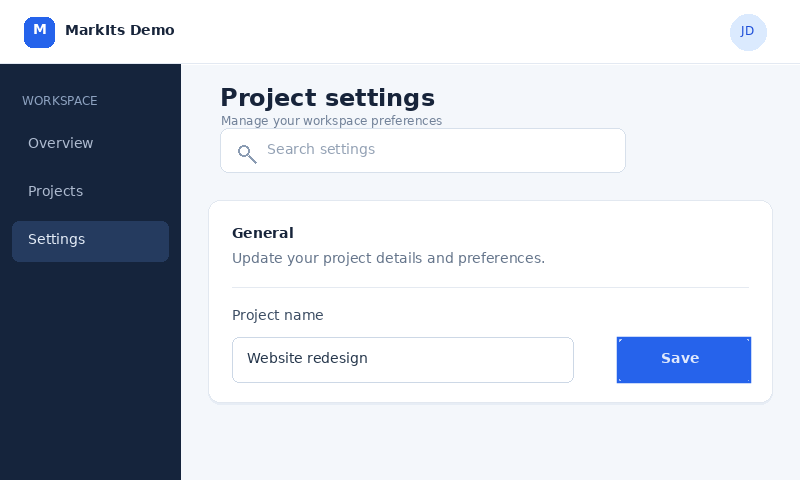](docs/images/llm_rect_boxed.png)  
`markits annotate docs/images/llm_demo_input.png --target "Save" --mark rect -o docs/images/llm_rect_boxed.png`

#### 例 2: 操作対象をスポットライトで示す
[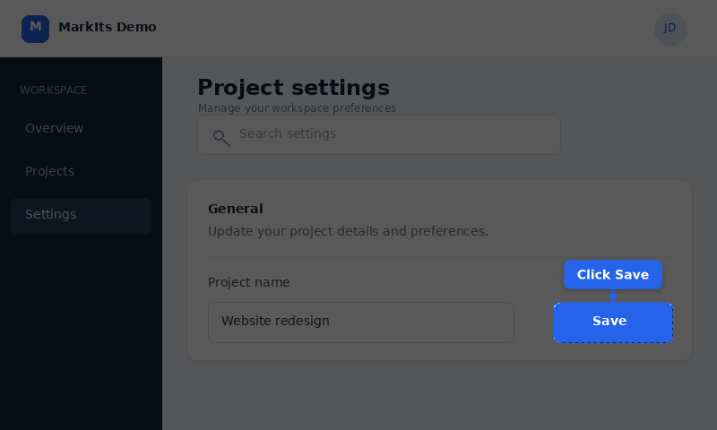](docs/images/llm_focus_labeled.png)  
`markits annotate docs/images/llm_demo_input.png --target "Save" --mark spotlight -o docs/images/llm_focus_labeled.png`

#### 例 3: 操作順を番号で示す
[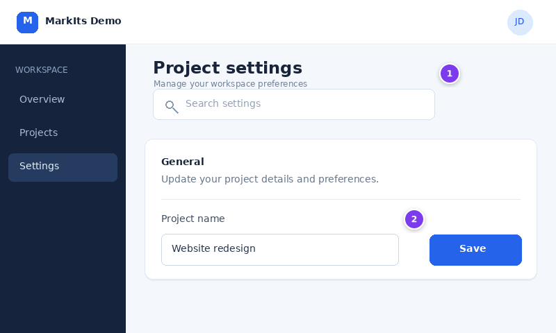](docs/images/llm_steps_numbered.png)  
`markits annotate docs/images/llm_demo_input.png --target "Search" --mark badge --step 1 -o docs/images/llm_steps_numbered.png`

---


## 🔖 対応マーク（アノテーション）一覧 & スクリーンショット

MarkIts で利用可能な全 13 種類のマーク（アノテーション）の一覧です。UI 上の対象要素（`target`）に合わせて自動レイアウトされ、視認性の高いアノテーション SVG を出力します。

### マーククイック一覧表

| マーク種別 (`type`) | 概要 / 主な用途 | 主なオプション |
| :--- | :--- | :--- |
| [`callout`](#1-callout-コールアウト) | テキストピル＋自動ルーティング引出線矢印 | `text`, `style`, `position`, `outline`, `shadow` |
| [`pin`](#2-pin-ピンタグ--skitch-スタイル) | アイコン入りピンヘッド＋三角ポインター＋連結テキスト（Skitch風） | `icon`, `text`, `style`, `position`, `outline`, `shadow` |
| [`badge`](#3-badge-ステップバッジ) | 操作手順番号やステップを示す円形バッジ | `step`, `text`, `style`, `position`, `shadow` |
| [`step-arrow`](#4-step-arrow-矢印つき番号--ステップアロー) | 矢印で対象を指し示す番号バッジ（手順案内向け） | `step`, `text`, `style`, `position`, `shadow` |
| [`label`](#5-label-テキストラベル) | フチ取り（アウトライン）対応の高視認性テキストピル | `text`, `style`, `position`, `outline`, `shadow` |
| [`rect`](#6-rect-矩形ハイライト) | 領域を半透明カラーと枠線で囲む矩形ハイライト | `style`, `shadow` |
| [`rounded-rect`](#7-rounded-rect-角丸矩形ハイライト) | 角丸の半径（丸み）を自在に調整できるハイライト枠 | `rx`, `ry`, `style`, `shadow` |
| [`circle`](#8-circle--ellipse-円形楕円ハイライト) | アバターや丸型アイコン・ボタンを囲む円形・楕円ハイライト | `style`, `shadow` |
| [`arrow`](#9-arrow-ポインター矢印) | 注目対象をダイレクトに指し示す方向指示矢印 | `position`, `style`, `shadow` |
| [`bezier-arrow`](#10-bezier-arrow-ベジェ矢印--曲線コネクタ) | 始点・中間点・終点を結ぶ曲線矢印。中間にテキスト配置対応（枠あり・枠なし・離れ距離調整対応） | `start`, `control`, `end`, `text`, `box`, `offset`, `position`, `style`, `shadow`, `outline` |
| [`bullseye`](#11-bullseye-ブルズアイ--注目点マーカー) | クリック位置や注目箇所を精密に示す同心円マーカー | `style`, `shadow` |
| [`divider`](#12-divider-区切り線--セパレーター) | 画面セクションや手順フェーズを視覚的に分ける区切り線 | `style` |
| [`spotlight`](#13-spotlight-スポットライト) | 画面全体を暗転させ、対象領域のみをくり抜いてフォーカス | `style` |

---

### 各マークの詳細仕様 & JSON 例

#### 1. `callout` (コールアウト)
ターゲット要素を指す矢印と説明文を生成します。複数の callout がある場合は全候補を採点し、画面外へのはみ出し、ラベルや target との重なり、矢印の交差を抑える配置に更新します。

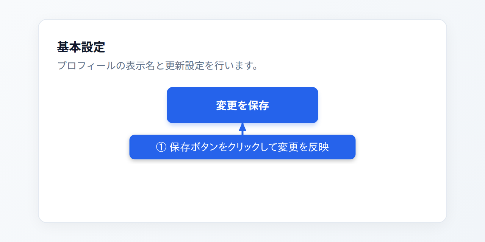

```json
{
  "type": "callout",
  "target": [220, 115, 200, 48],
  "text": "① 保存ボタンをクリックして変更を反映",
  "style": "primary",
  "position": "bottom",
  "outline": false,
  "shadow": true
}
```

- **主なプロパティ**:
  - `target` *(必須)*: 対象領域 `[x, y, width, height]` または `{"x": 220, "y": 115, "width": 200, "height": 48}`
  - `text` *(必須)*: 表示する説明テキスト
  - `max_width`: テキスト枠の最大幅（40 px 以上）。省略時は画面幅に応じて最大 320 px。日本語と英語を自動改行
  - `style`: セマンティックスタイル（デフォルト: `"primary"`）
  - `position`: 配置優先ヒント（`"auto"`, `"top"`, `"bottom"`, `"left"`, `"right"`, `"top-left"`, `"top-right"`, `"bottom-left"`, `"bottom-right"`、デフォルト: `"auto"`）
  - `outline`: 白フチ文字（`true` / `false`、デフォルト: `true`）
  - `shadow`: ドロップシャドウ（`true` / `false`、デフォルト: `false`）

---

#### 2. `pin` (ピンタグ / Skitch スタイル)
記号・文字・絵文字（例: `?`, `♡`, `★`, `1` など）が入る円形ピンヘッド、対象を指す三角ポインター、そして連結されたダーク調のテキストピルで構成される Skitch 風のピンアノテーションです（別名: `pin_callout`, `pin-callout`）。

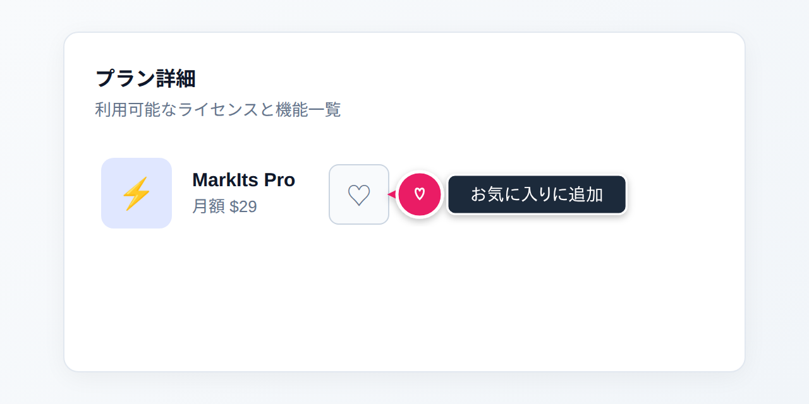

```json
{
  "type": "pin",
  "target": [260, 130, 48, 48],
  "icon": "♡",
  "text": "お気に入りに追加",
  "style": "pink",
  "position": "right",
  "outline": false
}
```

- **主なプロパティ**:
  - `target` *(必須)*: 対象領域
  - `icon`: ピンヘッド内に表示する記号・アイコン・1文字（省略可）
  - `text`: ピンヘッドに連結するダークピルテキスト（省略時はピンヘッド＋ポインターのみ）
  - `style`: セマンティックスタイル（デフォルト: `"pink"`）
  - `position`: ピンの配置方向（`"left"`, `"right"`, `"top"`, `"bottom"`、デフォルト: `"auto"`）
  - `outline`: 白フチ文字（`true` / `false`、デフォルト: `true`）
  - `shadow`: ドロップシャドウ（`true` / `false`、デフォルト: `false`）

---

#### 3. `badge` (ステップバッジ)
チュートリアルや操作手順ガイド（①、②、Step 1、Step 2...）に最適な円形の番号マーカーです。ターゲット矩形のコーナーや周囲にオフセット配置されます。

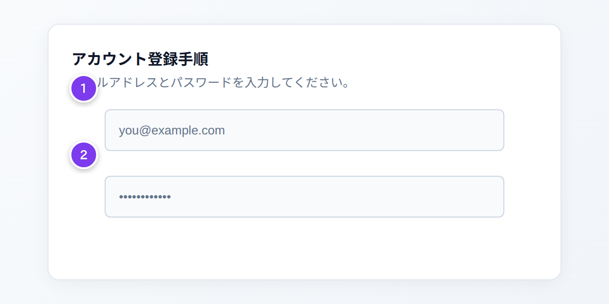

```json
{
  "canvas": { "width": 640, "height": 320 },
  "annotations": [
    {
      "type": "badge",
      "target": [110, 115, 420, 44],
      "step": 1,
      "style": "step",
      "position": "top-left"
    },
    {
      "type": "badge",
      "target": [110, 185, 420, 44],
      "step": 2,
      "style": "step",
      "position": "top-left"
    }
  ]
}
```

- **主なプロパティ**:
  - `target` *(必須)*: 対象領域
  - `step`: 手順番号（数値 `1`, `2`, ...）
  - `text`: 文字列での指定（`step` の代わりに使用可能）
  - `style`: セマンティックスタイル（ステップ推奨: `"step"`、デフォルト: `"primary"`）
  - `position`: 配置コーナー（`"top-left"`, `"top-right"`, `"bottom-left"`, `"bottom-right"` など、デフォルト: `"top-left"`）
  - `arrow`: `true` に設定すると矢印付き番号（`step-arrow`）として描画（デフォルト: `false`）
  - `shadow`: ドロップシャドウの有無（`true` / `false`、デフォルト: `false`）

---

#### 4. `step-arrow` (矢印つき番号 / ステップアロー)
操作マニュアルやチュートリアルで頻出する、**番号バッジ（①、②、1、2...）から対象要素へ向けて矢印が伸びる**アノテーションです（別名: `number-arrow`, `numbered-arrow`, `arrow-badge`）。適切なオフセットで番号マーカーを自動配置し、対象要素へ直接矢印線を伸ばすため、複数ステップの操作順序が一目で伝わります。


```json
{
  "canvas": { "width": 640, "height": 320 },
  "annotations": [
    {
      "type": "step-arrow",
      "target": [240, 110, 280, 44],
      "step": 1,
      "style": "step",
      "position": "left"
    },
    {
      "type": "step-arrow",
      "target": [240, 185, 200, 46],
      "step": 2,
      "style": "step",
      "position": "left"
    }
  ]
}
```

- **主なプロパティ**:
  - `target` *(必須)*: 対象領域 `[x, y, width, height]`
  - `step`: 手順番号（数値 `1`, `2`, ...）
  - `text`: 任意の文字列（`"①"`, `"A"` など）
  - `style`: セマンティックスタイル（デフォルト: `"step"`）
  - `position`: バッジの配置方向（`"left"`, `"right"`, `"top"`, `"bottom"`, `"auto"` など、デフォルト: `"auto"`）
  - `shadow`: ドロップシャドウの有無（`true` / `false`、デフォルト: `false`）

> [!TIP]
> `type: "step-arrow"` 以外にも、既存の `badge` に `"arrow": true` を指定するか、または `arrow` に `"step": 1` を指定しても自動的に矢印つき番号として描画されます。

---

#### 5. `label` (テキストラベル)
引出線矢印を伴わず、対象領域のすぐそばに直接注釈テキストピルを配置します。`\n` による複数行テキストにも対応しています。


```json
{
  "type": "label",
  "target": [110, 150, 420, 44],
  "text": "⚠️ 外部に公開しないでください",
  "style": "warning",
  "position": "top",
  "outline": false
}
```

- **主なプロパティ**:
  - `target` *(必須)*: 対象領域
  - `text` *(必須)*: 表示テキスト（改行 `\n` 対応）
  - `style`: セマンティックスタイル（デフォルト: `"primary"`）
  - `position`: 配置方向（`"top"`, `"bottom"`, `"left"`, `"right"` など、デフォルト: `"top"`）
  - `outline`: 白フチ取りの有無（`true` / `false`、デフォルト: `true`）
  - `shadow`: ドロップシャドウの有無（`true` / `false`、デフォルト: `false`）

---

#### 6. `rect` (矩形ハイライト)
対象領域を薄い透過色で塗りつぶし、境界線で強調します。テーブルの行、カード、ボタン領域全体のフォーカスに適しています。


```json
{
  "type": "rect",
  "target": [75, 110, 490, 125],
  "style": "primary"
}
```

- **主なプロパティ**:
  - `target` *(必須)*: 対象矩形領域 `[x, y, width, height]`
  - `style`: セマンティックスタイル（デフォルト: `"primary"`）
  - `shadow`: ドロップシャドウの有無（`true` / `false`、デフォルト: `false`）

---

#### 7. `rounded-rect` (角丸矩形ハイライト)
角丸を持つ UI 要素（ドロップゾーン、モーダル、ボタン、タグなど）にぴたりとフィットするハイライト枠です（別名: `rounded_rect`）。`rx`、`ry` で角丸の半径（丸み）を自由に調整できます。


```json
{
  "type": "rounded-rect",
  "target": [100, 105, 440, 115],
  "rx": 16,
  "ry": 16,
  "style": "info"
}
```

- **主なプロパティ**:
  - `target` *(必須)*: 対象領域
  - `rx`: 水平方向の角丸半径（デフォルト: `8.0`）
  - `ry`: 垂直方向の角丸半径（デフォルト: `8.0`）
  - `style`: セマンティックスタイル（デフォルト: `"primary"`）
  - `shadow`: ドロップシャドウの有無（`true` / `false`、デフォルト: `false`）

---

#### 8. `circle` / `ellipse` (円形・楕円ハイライト)
丸型アバター、アイコンボタン、トグルスイッチ、ラジオボタンなどを囲んで強調します（別名: `ellipse`）。幅と高さの比率に応じて正円または楕円形になります。

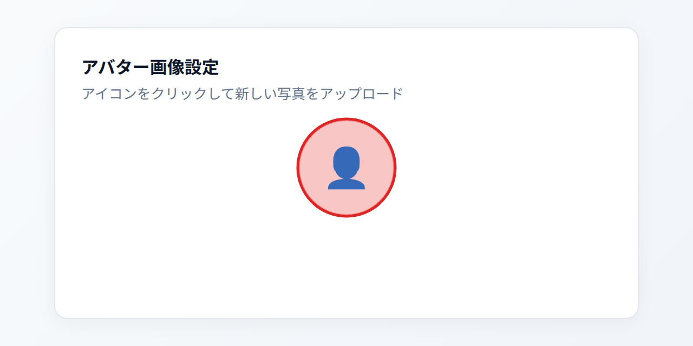

```json
{
  "type": "circle",
  "target": [275, 110, 90, 90],
  "style": "danger"
}
```

- **主なプロパティ**:
  - `target` *(必須)*: 対象領域（正円の場合は幅＝高さ）
  - `style`: セマンティックスタイル（デフォルト: `"primary"`）
  - `shadow`: ドロップシャドウの有無（`true` / `false`、デフォルト: `false`）

---

#### 9. `arrow` (ポインター矢印)
ターゲットの端点に向けてシャープな矢印線を引き、特定の位置やボタンを指し示します。

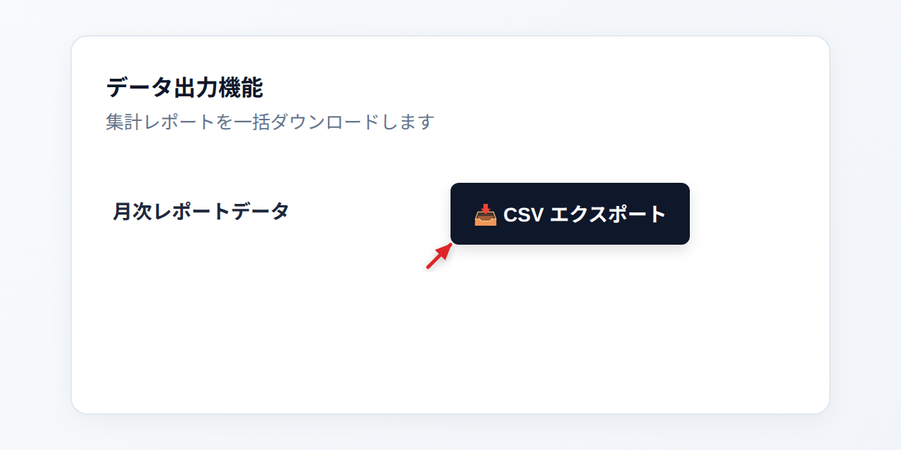

```json
{
  "type": "arrow",
  "target": [320, 130, 170, 44],
  "position": "bottom-left",
  "style": "danger"
}
```

- **主なプロパティ**:
  - `target` *(必須)*: 対象領域
  - `position`: 矢印の起点方向（`"left"`, `"right"`, `"top"`, `"bottom"`, `"bottom-left"` など、デフォルト: `"auto"`）
  - `style`: セマンティックスタイル（デフォルト: `"primary"`）
  - `shadow`: ドロップシャドウの有無（`true` / `false`、デフォルト: `false`）

---

#### 10. `bezier-arrow` (ベジェ矢印 / 曲線コネクタ)
始点（`start`）、中間制御点（`control`）、終点（`end`）の3点で制御される滑らかな2次ベジェ曲線矢印を描画します（別名: `curved-arrow`, `curved_arrow`, `curve-arrow`, `bezier`）。
**矢印の中間位置（カーブ頂点付近）に説明テキスト（`text`）を配置可能**で、データフローや状態遷移、関連付けの図示に最適です。

- **重なり回避**: デフォルト（`position: "auto"`）では、曲線の外側（上向きカーブなら上部）に適度なクリアランスを空けて自動配置するため、**矢印線とテキストが重なることなく美しく描画**されます。
- **枠あり / 枠なしの選択 (`box`)**:
  - `box: true`（デフォルト）: スタイルカラーの角丸長方形ピル＋白文字
  - `box: false`: 背景の枠（囲い）を描画せず、スタイルカラー文字＋白フチ（`outline: true`）で矢印の上に浮かせて表示

| 枠ありピル (`box: true`) | 枠なしテキスト (`box: false`) |
| :---: | :---: |
| 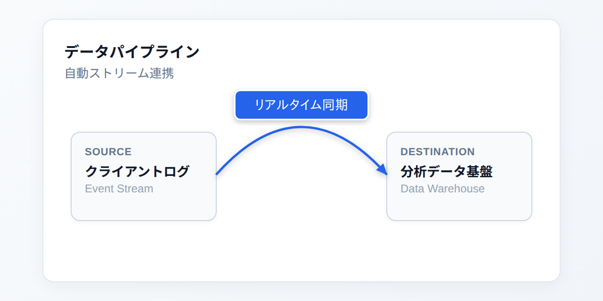 | 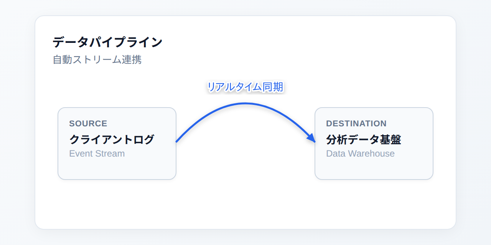 |

```json
{
  "canvas": { "width": 640, "height": 320 },
  "annotations": [
    {
      "type": "bezier-arrow",
      "start": [230, 185],
      "control": [320, 85],
      "end": [410, 185],
      "text": "リアルタイム同期",
      "style": "primary",
      "box": true,
      "position": "auto"
    }
  ]
}
```

- **主なプロパティ**:
  - `start` (`from`, `p0`): 矢印の始点座標 `[x, y]` または `{"x": 230, "y": 185}`
  - `control` (`mid`, `middle`, `via`, `p1`, `intermediate`): 曲線のカーブを制御する中間制御点 `[x, y]`（省略時は始点・終点の中間上方に自動配置）
  - `end` (`to`, `p2`): 矢頭（矢印の先）が向かう終点座標 `[x, y]`
  - `text`: 矢印の中間に表示する説明ラベル（省略可）
  - `offset` (`gap`, `distance`): **矢印線とテキストの離れる距離（ピクセル単位）**。数値を指定して自由に離れ具合を調整可能（例: `12`, `16`, `24`。省略時は `box: true` で 8px、`box: false` で 6px）
  - `position`: テキストの配置位置（`"auto"`: 曲線外側に自動配置 / `"top"`: 曲線の上 / `"bottom"`: 曲線の内側・下 / `"center"`: 曲線直上、デフォルト: `"auto"`）
  - `box` (`boxed`, `enclosure`, `pill`, `frame`): テキストの背景枠・囲いの有無（`true`: 枠あり角丸ピル / `false`: 枠なし浮動テキスト、デフォルト: `true`）
  - `t` (`ratio`, `progress`): 曲線上の配置比率（`0.0` 〜 `1.0`、デフォルト: `0.5`）
  - `style`: セマンティックスタイル（デフォルト: `"primary"`）
  - `shadow`: ドロップシャドウ（`true` / `false`、デフォルト: `true`）
  - `outline`: 白フチ取り（`true` / `false`、デフォルト: `true`）
  - `target`: `start`/`control`/`end` の代わりに矩形 `target` を指定して上部アーチ矢印を自動生成することも可能

---

#### 11. `bullseye` (ブルズアイ / 注目点マーカー)
二重同心円＋中心ドットで構成される精密ターゲットマーカーです。トグルスイッチのつまみ、チェックボックス、アイコンの中心など「ここをクリック」というピンポイントの指定に最適です。


```json
{
  "type": "bullseye",
  "target": [430, 135, 40, 40],
  "style": "danger"
}
```

- **主なプロパティ**:
  - `target` *(必須)*: 中心位置を求めるための対象領域
  - `style`: セマンティックスタイル（デフォルト: `"primary"`）
  - `shadow`: ドロップシャドウの有無（`true` / `false`、デフォルト: `false`）

---

#### 12. `divider` (区切り線 / セパレーター)
画面を論理的なグループに分けたり、ビフォー・アフターや手順の段階を仕切るためのセパレーターライン（丸端ラインキャップ）を描画します。

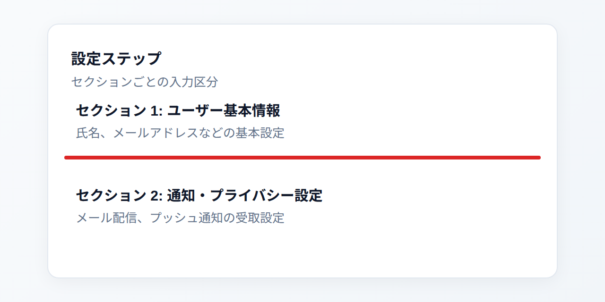

```json
{
  "type": "divider",
  "target": [70, 165, 500, 4],
  "style": "danger"
}
```

- **主なプロパティ**:
  - `target` *(必須)*: 水平線は `[x, y, width, thickness]`、垂直線は `[x, y, thickness, height]`
  - `style`: セマンティックスタイル（デフォルト: `"primary"`）

---

#### 13. `spotlight` (スポットライト)
キャンバス全体に暗色半透明のバックドロップマスク（透過率 65%）を敷き、注目させたい領域だけをくり抜いて点線枠でハイライトします。ユーザーの視線を迷わせずに特定領域へ集中させます。


```json
{
  "type": "spotlight",
  "target": [110, 85, 420, 48],
  "style": "primary"
}
```

- **主なプロパティ**:
  - `target` *(必須)*: くり抜く対象領域
  - `style`: くり抜き枠の点線カラーを決めるセマンティックスタイル（デフォルト: `"primary"`）

---

## 🎨 セマンティックスタイル (カラーパレット)

MarkIts では、色コードを直接指定する代わりに、デザインシステムに基づいた 7 つの「意味的（セマンティック）スタイル」を指定します。

<p align="center">
  
</p>

| スタイル名 | カラーコード | 意味・おすすめ用途 |
| :--- | :--- | :--- |
| `primary` | `#2563eb` (Blue-600) | 標準のアノテーション、主要アクション、メイン情報 |
| `secondary` | `#4b5563` (Gray-600) | 補足情報、副次的な説明、控えめな区切り線 |
| `warning` | `#d97706` (Amber-600) | 注意喚起、必須入力の漏れ、推奨事項 |
| `danger` | `#dc2626` (Red-600) | 警告、削除操作、重要な注目点、クリティカルな操作 |
| `info` | `#0284c7` (Sky-600) | ヒント、参考情報、新機能の案内 |
| `step` | `#7c3aed` (Violet-600) | 手順ガイド、ステップ番号、ワークフロー番号 |
| `pink` | `#ea1a65` (Skitch Magenta) | アイコンピン、お気に入り、目を引くワンポイント注釈 |

---

## 📐 座標指定 (`target`) & 配置ヒント (`position`)

### 座標指定 (`target`)
アノテーションが指し示す対象領域は、以下のいずれのフォーマットでも記述可能です：

1. **4 要素配列形式**（シンプルで推奨）：
   ```json
   "target": [100, 150, 240, 50]
   // [x, y, width, height]
   ```
2. **オブジェクト形式**（キー指定）：
   ```json
   "target": { "x": 100, "y": 150, "width": 240, "height": 50 }
   // または省略形 {"x": 100, "y": 150, "w": 240, "h": 50}
   ```

### 配置優先ヒント (`position`)
`callout`, `pin`, `badge`, `step-arrow`, `label`, `arrow` で指定可能です：
- `"auto"`: レイアウトエンジンがキャンバス境界や他要素との衝突を計算して最適な位置を自動決定
- `"top"`, `"bottom"`, `"left"`, `"right"`: 上下左右の各方向を優先
- `"top-left"`, `"top-right"`, `"bottom-left"`, `"bottom-right"`: コーナー位置を優先（`badge` や斜め矢印で有効）

---

## 主な特徴

- 🎯 **決定論的自動レイアウト**: ターゲット矩形の周囲8方向への候補生成、キャンバスはみ出し防止、衝突回避、矢印ルーティング
- 📐 **多様なアノテーション種別**: コールアウト、ピン、バッジ、矢印付き番号（ステップアロー）、各種図形、矢印、ブルズアイ、区切り線、スポットライト
- 🎨 **セマンティックスタイル & テーマ**: `primary`, `secondary`, `warning`, `danger`, `info`, `step`, `pink`
- 🔲 **視覚効果オプション**: 白フチ（`outline: true`）、ドロップシャドウの有無（`shadow: true / false`）のグローバルおよび要素別切り替え
- ⚡ **Pure Rust**: C依存関係ゼロで高速・クロスプラットフォーム

---

## インストール & CLI 利用方法

### 一括注釈・テンプレート・連続撮影

```sh
# 複数マークを一度に描画し、チームの既定スタイルを適用
markits annotate-batch screenshot.png examples/batch_marks.json --template examples/team_style.json -o annotated.png

# 3秒後から1秒間隔で3枚撮影（capture_001.png など）
markits capture-series capture.png --delay-ms 3000 --count 3 --interval-ms 1000
```

`annotate-batch` のマークファイルは注釈配列、または `annotations` 配列を持つ JSON です。テンプレートは `style`、`position`、`shadow`、`outline`、`stroke_width`、矢印用の `arrow_skin`、`line_style`、`arrowhead` の既定値を指定します。個々のマークの値が優先されます。`--uimap` に指定した PNG と対象画像の寸法が異なる場合は警告が出ます。

デスクトップの「共有用に保存」は矩形マークの内側を黒塗りし、元画像と編集用メタデータを除去します。共有前に矩形で隠す範囲を指定してください。通常の保存は再編集に必要な情報を保持します。

デスクトップの選択中マークには「標準」「強調」「控えめ」「手順」のスタイルプリセットがあります。直線矢印と曲線矢印では、形のプレビューから `arrow_skin` の `classic`（標準）/ `sketch`（太い輪郭と斜線を持つ手描き風）/ `bold`（先細りの塗り矢印）を選べます。`line_style` の `solid` / `dashed` / `dotted` と `arrowhead` の `filled` / `open` は標準形に適用されます。

矢印の `text_placement` はラベルを置く基準位置です。`middle` は矢印の中央、`end` は三角の先端ではなく矢印の始点側（矢印のない終端）です。ラベルの大きさと矢印の向きを使って、線や端と重ならない側へ配置します。曲線矢印の `position` は中央ラベルを曲線のどちら側に置くかのヒントです。

### ビルド済みバイナリのダウンロード
[GitHub Releases](https://github.com/tamon-ishii/markits/releases) より、各 OS 向けの最適化済み実行可能バイナリをダウンロードしてそのまま利用できます：
- **Linux**: `x86_64` (glibc / musl static), `aarch64` (ARM64)
- **macOS**: `universal` (Apple Silicon & Intel 両対応), `aarch64` (M1/M2/M3/M4), `x86_64` (Intel)
- **Windows**: `x86_64`

### ソースコードからのビルド
```bash
cargo build --release
```

### コマンドラインからのレンダリング
```bash
# JSON ファイルから SVG を生成して標準出力
markits render input.json > overlay.svg

# 元画像に注釈を重ねて PNG を保存（JSON の canvas は省略可能）
markits render input.json --image screenshot.png --output annotated.png

# 画像の寸法と形式を確認
markits inspect screenshot.png

# パイプ (stdin) 経由で生成
cat input.json | markits render - > overlay.svg

# 入力の検証と配置結果の取得
markits validate input.json
markits validate input.json --image screenshot.png
markits render input.json --layout-json > layout.json
markits render input.json --debug > layout-debug.svg

# AI/LLM 向けの英語 Markdown マニュアルを表示
markits manual
```

---

## 入力 JSON 例 (Semantic Intent)

`targets` に名前と矩形を登録すると、各注釈で座標の代わりに名前を参照できます。`instruction` は操作の意図から強調表示と callout を生成します。`position` を省略すると `auto` になります。

```json
{
  "canvas": { "width": 1200, "height": 750 },
  "targets": { "save-button": [820, 640, 100, 36] },
  "annotations": [
    { "id": "step1", "type": "instruction", "target": "save-button", "action": "click", "text": "保存をクリック" }
  ]
}
```

`action` は `click`、`enter`、`select`、`drag`、`attention`、`warning`、`compare` に対応します。`click` と `attention` は spotlight と callout、その他は角丸の枠と callout に展開します。`drag` と `compare` には2番目の target を `destination` で指定します。`drag` は2つの target 間の矢印も描きます。`--layout-json` は SVG と、各部品の `id`、`bounds`、`arrow_path` を返します。入力形式の定義は [markits.schema.json](markits.schema.json) を参照してください。

従来の座標指定も利用できます。

```json
{
  "canvas": {
    "width": 1200,
    "height": 750
  },
  "shadow": true,
  "annotations": [
    {
      "type": "divider",
      "target": [50, 310, 900, 4],
      "style": "danger"
    },
    {
      "type": "step-arrow",
      "target": [80, 80, 320, 140],
      "step": 1,
      "style": "step",
      "position": "left"
    },
    {
      "type": "pin",
      "target": [440, 140, 60, 60],
      "icon": "?",
      "text": "これは何？",
      "style": "info",
      "position": "right",
      "outline": true
    },
    {
      "type": "bullseye",
      "target": [470, 360, 50, 50],
      "style": "danger"
    },
    {
      "type": "callout",
      "target": [80, 80, 320, 140],
      "text": "検索フィールドをクリック",
      "style": "primary",
      "position": "bottom"
    }
  ]
}
```

---

## Rust ライブラリとしての利用

```rust
use markits::{render_from_json, Scene};

fn main() -> Result<(), Box<dyn std::error::Error>> {
    let json_data = r#"{
        "canvas": { "width": 800, "height": 600 },
        "annotations": [
            {
                "type": "step-arrow",
                "target": [100, 100, 200, 50],
                "step": 1,
                "style": "step",
                "position": "left"
            }
        ]
    }"#;

    // 直接 JSON 文字列から SVG を出力
    let svg = render_from_json(json_data)?;
    println!("{}", svg);

    Ok(())
}
```

---

## ライセンス

MIT
