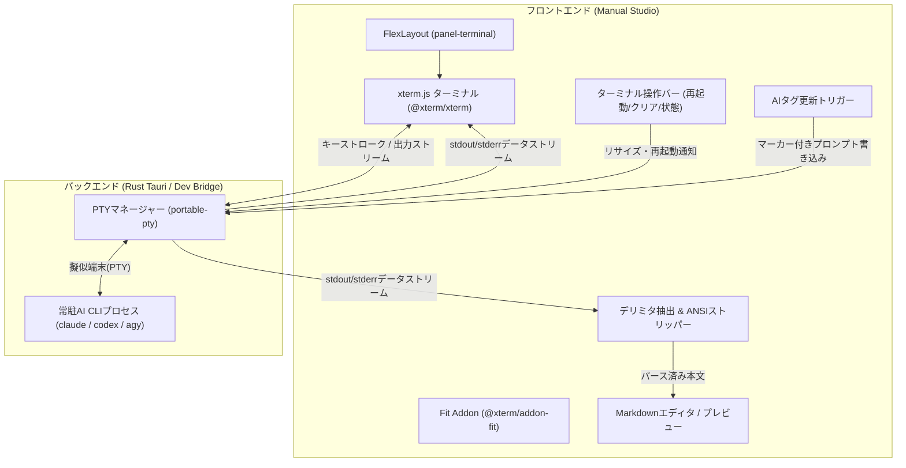

# 常駐AI CLIセッションとxterm.js対話ターミナル統合 設計仕様書

## 1. 概要 (Overview)
Munin Manual Studio において、AI CLI（Claude Code、Codex、Agy等）を毎回新規起動（コールドスタート）することによる初期トークン消費・起動遅延を抑え、単一の常駐CLIプロセスを使い回すアーキテクチャを導入する。
また、フロントエンドに `xterm.js` を組み込み、FlexLayoutのDockパネル上でAI CLIと直接対話できるターミナル環境を提供するとともに、ドキュメント内のAIタグ（`ai:task`）生成・更新プロンプトをこの常駐CLIへ直接投入し、出力を自動抽出して原稿へ反映する仕組みを構築する。

---

## 2. 目的と成功基準 (Goals & Success Criteria)

### 目的
1. **初期トークン・オーバーヘッドの削減**:
   - ワークスペースに対して1つのAI CLIセッションを維持し、プロンプトキャッシュやコンテキスト初期化コストをセッション間で再利用する。
2. **対話型ターミナル（xterm.js）の提供**:
   - Studio画面内でCLI（Claude Code, Codex, Agy）と直接TUI/REPL対話を行えるようにする。
3. **AIタグ自動更新とのシームレスな統合**:
   - UIの「AIタグを更新」操作時、常駐CLIに対象タスクのプロンプトを流し込み、ターミナル上に推論ログをリアルタイム描画しつつ、生成結果テキストを抽出して原稿に自動反映する。

### 成功基準
- xterm.js が FlexLayout の下部ペイン（`tabset-bottom`）に「AIターミナル」タブとして正常に表示され、リサイズやタブ切り替えに追従すること。
- ワークスペース起動時に設定されたAI CLI（Claude Code等）がPTYプロセスとして自動起動し、キーボード入力・画面出力ができること。
- 「この文書のAIタグを更新」等の操作を行った際、常駐CLIセッションへプロンプトが送信され、完了時に生成されたMarkdownテキストが原稿のAIタグに反映されること。
- 既存のE2Eスモークテスト（`manual:smoke`）およびテストスイート（`manual:check`）がすべて正常に通過すること。

---

## 3. システムアーキテクチャ (Architecture)

### 3.1 コンポーネント構成



### 3.2 バックエンドPTY管理 (Rust / Tauri & Dev Server)
- **ライブラリ**: `portable-pty`
  - クロスプラットフォーム（Linux / macOS / Windows）で擬似端末（PTY）を開放・制御。
- **PTYマネージャー**:
  - ワークスペースパスをカレントディレクトリとして設定中のAI CLIバイナリ（`claude`, `codex`, `agy`）を実行。
  - プロセス生存監視、終了時の自動検知。
  - PTYリサイズ要求（`cols`, `rows`）をOSのPTYデバイスへ伝播。
  - `pty_write(data)`: 標準入力へバイト列を書き込み。
  - `pty_read`: 標準出力・標準エラー出力を非同期ストリームとしてフロントエンドへ中継。
- **Tauri IPC**:
  - `pty_spawn`, `pty_write`, `pty_resize`, `pty_kill` コマンドおよび `pty_output` イベント。
- **Dev Server Bridge**:
  - Vite開発サーバー（`npm run manual:dev` / `smoke`）環境では、WebSocket / HTTPストリーミングを介して同様のPTY通信をブリッジ。

---

## 4. フロントエンド設計 (Frontend Design)

### 4.1 FlexLayout 統合
- **パネル定義 (`PANELS`)**:
  - `{ id: "terminal", name: "AIターミナル", elementId: "panel-terminal" }` を追加。
- **初期配置 (`defaultLayoutJson`)**:
  - `tabset-bottom`（初期配置の下部ペイン）に配置：
    - `ai-tags`（AIタグ一覧、weight: 50）
    - `terminal`（AIターミナル、weight: 50）
  - ユーザーは任意の場所（エディタ右側や別ペイン等）へドラッグ＆ドロップでレイアウト変更可能。

### 4.2 xterm.js 構成
- **依存関係**:
  - `@xterm/xterm`
  - `@xterm/addon-fit`
  - `@xterm/addon-web-links`
- **外観・テーマ連動**:
  - Studioのアクティブテーマ（フォレスト、ミッドナイト、チャコール等）に応じて、CSS変数（`--surface-bg`, `--text-primary`, `--selection-bg`, `--accent`）を xterm.js のカラーパレットに同期。
- **ターミナルツールバー**:
  - ステータスバッジ（`● 実行中` / `○ 停止`）
  - CLI名ラベル（`claude`, `codex`, `agy` 等）
  - 「再起動」ボタン（プロセスKill & 再生）
  - 「画面クリア」ボタン（ターミナル画面消去）

---

## 5. AIタグ更新フローと抽出エンジン (Tag Generation & Extraction)

### 5.1 プロンプト注入手順
1. ユーザーが「この文書のAIタグを更新」またはカード上のタスク更新を実行。
2. Studio側でプロンプト本文を構築し、末尾に専用デリミタ要求を付加：
   ```text
   重要: 最終的な生成本文（Markdown）は、必ず以下のデリミタで囲んで出力してください。
   <<<MANUAL_STUDIO_RESULT_START>>>
   (ここに生成した本文)
   <<<MANUAL_STUDIO_RESULT_END>>>
   ```
3. PTYの標準入力へ注入（改行コード付与）。

### 5.2 ストリーム監視と抽出ロジック
1. PTYからの出力データは常に xterm.js に書き込み（リアルタイム表示）。
2. 同時にストリームバッファ上で `<<<MANUAL_STUDIO_RESULT_START>>>` を走査。
3. 開始マーカー検知後、`<<<MANUAL_STUDIO_RESULT_END>>>` までのチャンクをバッファリング。
4. 終了マーカー検知時に、ANSIエスケープシーケンス（文字装飾、カーソル制御等）を除去：
   ```typescript
   function stripAnsi(text: string): string {
     return text.replace(/\x1B(?:[@-Z\\-_]|\[[0-?]*[ -/]*[@-~])/g, "");
   }
   ```
5. 対象の `<!-- ai:task id="..." -->` タグ内に抽出本文を反映し、エディタおよびプレビューをリフレッシュ。

### 5.3 エラーハンドリング・フォールバック
- **マーカー未出力 / タイムアウト**:
  - 一定時間（例: 60秒）終了マーカーが検知されない場合やCLIが異常終了した場合、タイムアウト通知を表示。
  - ターミナル上にはCLIの全出力が残っているため、ユーザーはターミナルから直接内容を確認・コピー可能。
- **プロセス停止時の復帰**:
  - プロセス終了時はツールバーのステータスバッジを「停止」にし、「再起動」ボタンを強調。

---

## 6. テスト・検証計画 (Verification Plan)

1. **単体テスト**:
   - ANSI除去・デリミタ抽出パーサーの単体テスト（不完全なチャンク分割や特殊文字の処理確認）。
2. **ビルド検証**:
   - `npm run manual:build` によるTypeScriptおよびViteビルド。
3. **E2Eスモークテスト**:
   - `npm run manual:smoke` にターミナルパネル存在確認、リサイズ、ツールバー操作の検証を追加。
4. **ワークフロー・総合検証**:
   - `npm run manual:test-workflow`
   - `npm run manual:check`（全15ステップの総合チェック）
